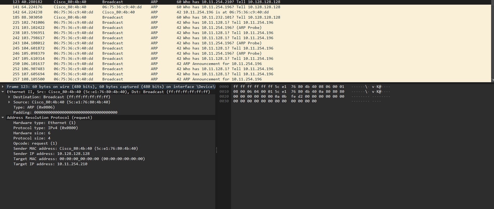

```
Question -1:
------------

capture and analyze arp ARP packets using wireshark. Inspect the Arp request and reply frames.

Answer:
------

Types of ARP:
------------

"Who has" Packets (ARP Request):
----------------------------------
These are ARP Request packets.When a device wants to know the MAC address corresponding to a specific IP address, it broadcasts a message saying “Who has [IP Address]? Tell [Sender’s IP Address].”
Example from my capture:
Who has 10.11.254.210? Tell 10.128.128.128
This means the device at 10.128.128.128 is asking the network for the MAC address of 10.11.254.210.

"Is at" Packets (ARP Reply):
----------------------------
These are ARP Reply packets.
The device owning the requested IP address responds with its MAC address, saying “[IP Address] is at [MAC Address].”
Example from my capture:
10.11.128.1 is at 7c:5a:1c:cf:f2:a5
This means the device with IP 10.11.128.1 has the MAC address 7c:5a:1c:cf:f2:a5.

ARP Announcement (Gratuitous ARP):
---------------------------------
This is a special type of ARP message where a device announces its own IP and MAC mapping without being asked.
It is often used for IP conflict detection,Updating other devices’ ARP caches,Announcing availability on the network.
Example from my capture:
ARP Announcement for 10.11.254.196
This means a device is broadcasting that it owns the IP address 10.11.254.196 and wants others to update their ARP cache accordingly.


ARP request:
------------
below image is the arp request packet captured in wireshark.
it has the following....

Address Resolution Protocol (request)
    Hardware type: Ethernet (1)
    Protocol type: IPv4 (0x0800)
    Hardware size: 6
    Protocol size: 4
    Opcode: request (1)
    Sender MAC address: Cisco_80:4b:40 (5c:e1:76:80:4b:40)
    Sender IP address: 10.128.128.128
    Target MAC address: 00:00:00_00:00:00 (00:00:00:00:00:00)
    Target IP address: 10.11.254.210


```


```
ARP reply:
----------
below is the ARP reply packet captured in wireshark with the following ...

Address Resolution Protocol (reply)
    Hardware type: Ethernet (1)
    Protocol type: IPv4 (0x0800)
    Hardware size: 6
    Protocol size: 4
    Opcode: reply (2)
    Sender MAC address: Sophos_cf:f2:a5 (7c:5a:1c:cf:f2:a5)
    Sender IP address: 10.11.128.1
    Target MAC address: 06:75:36:c9:40:dd (06:75:36:c9:40:dd)
    Target IP address: 10.11.254.196

```

```
ARP anouncement:
----------------
below is the ARP announcement packet captured in wireshark with the following ...

Address Resolution Protocol (ARP Announcement)
    Hardware type: Ethernet (1)
    Protocol type: IPv4 (0x0800)
    Hardware size: 6
    Protocol size: 4
    Opcode: request (1)
    [Is gratuitous: True]
    [Is announcement: True]
    Sender MAC address: 06:75:36:c9:40:dd (06:75:36:c9:40:dd)
    Sender IP address: 10.11.254.196
    Target MAC address: 00:00:00_00:00:00 (00:00:00:00:00:00)
    Target IP address: 10.11.254.196


```

