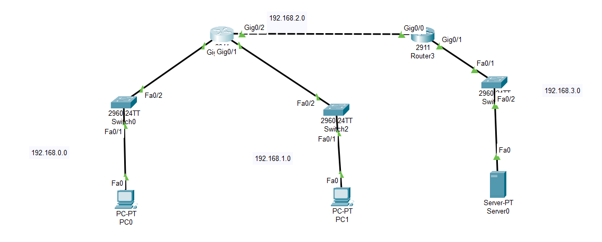

```

Question:
---------

Create an extended ACL to block specific applications, such as HTTP or FTP traffic.
Test the ACL rules by attempting to access blocked services.

Topology:
---------
```



```
configs:
--------
```


```
used extended ACL config in router 2:
-------------------------------------
	
Router>enable
Router#show access-lists
Extended IP access list test
    10 permit tcp 192.168.0.0 0.0.0.255 192.168.3.0 0.0.0.255 eq www

( this only allows the PC0 to access the http service and blocks all other packets ) 

show IP interface o/p (router2) :
--------------------
Router#show ip interface
GigabitEthernet0/0 is up, line protocol is up (connected)
  Internet address is 192.168.0.1/24
  Broadcast address is 255.255.255.255
  Address determined by setup command
  MTU is 1500 bytes
  Helper address is not set
  Directed broadcast forwarding is disabled
  Outgoing access list is not set
  Inbound  access list is test


Ping (ICMP) from PC0 to server 0 :
------------------------------------

this should be blocked ...
``` 


```
the http from PC0 to server0 is given below indicating the working of the Extended ACL.

```


